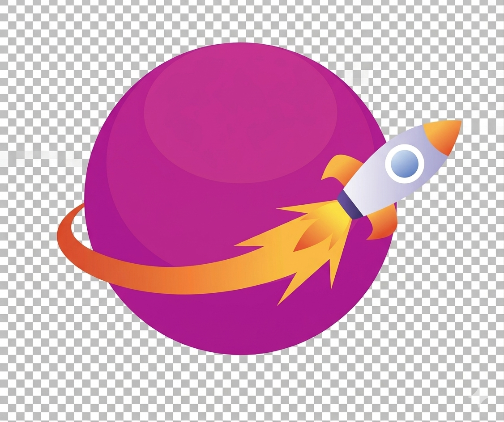

<p align="center">
  
</p>

# LandoDEV

**LandoDEV** is a desktop app for managing local **WordPress** development environments powered by [**Lando**](https://lando.dev). It wraps a [**Laravel**](https://laravel.com) + [**Livewire**](https://livewire.laravel.com) UI inside a [**NativePHP**](https://nativephp.com) / Electron shell so you can create sites, run Lando commands, clone environments, and tune PHP/DB/Redis defaults without living in the terminal.

## Tech stack

| Layer | Technology | Links |
|--------|------------|--------|
| Backend | PHP 8.2+, Laravel 12 | [Laravel](https://laravel.com/docs), [PHP](https://www.php.net) |
| UI | Livewire 3, Livewire Flux | [Livewire](https://livewire.laravel.com), [Flux](https://flux.laravel.com) |
| Desktop | NativePHP Electron | [NativePHP](https://nativephp.com), [Electron](https://www.electronjs.org) |
| CSS | Tailwind CSS v4, Vite | [Tailwind](https://tailwindcss.com), [Vite](https://vitejs.dev) |
| Local WP stack | Lando, WordPress, Docker | [Lando](https://docs.lando.dev), [WordPress](https://wordpress.org), [Docker](https://docs.docker.com) |

## Requirements

- **PHP** 8.2+ (Homebrew PHP is used for the NativePHP host; site runtimes are inside Lando containers).
- **Composer**, **Node.js** (see [`.nvmrc`](.nvmrc) for the expected major version), **npm**.
- **Lando** and **Docker** installed and working on the host.
- A **database** for Laravel (SQLite is fine for local dev).

## Quick start (developers)

```bash
git clone git@github.com:lajennylove/lando-installer.git
cd lando-installer
git checkout dev

cp .env.example .env
php artisan key:generate

# SQLite (default in .env.example) — or configure MySQL/Postgres
touch database/database.sqlite
php artisan migrate

composer install
npm install
npm run build
```

Start the web stack (browser / API only):

```bash
composer run dev
# or: php artisan serve  +  npm run dev  (Vite defaults to port 5175 — see vite.config.js)
```

Start the **NativePHP + Electron** desktop shell with Vite (macOS; run from a local terminal so Electron can open a window):

```bash
composer run native:dev
```

See [`scripts/native-dev.sh`](scripts/native-dev.sh) and [`scripts/native-php.sh`](scripts/native-php.sh) for how the app PHP binary is resolved.

## Usage (high level)

1. **First run / setup** — Visit `/setup` (route `setup`) to verify Lando, Docker, and related dependencies.
2. **Home** — `/` redirects to the latest site dashboard or to site creation.
3. **Create site** — `/create`, `/create/new`, `/create/clone` — guided flows that generate Lando config and run Lando/WP CLI steps (output is streamed in the UI).
4. **Site dashboard** — `/sites/{site}` — start/stop/rebuild, env versions, WordPress theme tools, destroy (async Lando + filesystem, then redirect).
5. **Settings** — defaults for new sites (PHP/MariaDB/Redis, code path) stored in app storage (see `.gitignore` for local JSON).
6. **About** — app version and stack summary.

Use **relative** `route(..., [], false)` / `wire:navigate` where the app is served on `127.0.0.1` (Electron) so URLs are not tied to `APP_URL` localhost mismatches.

## Project layout (not exhaustive)

| Path | Purpose |
|------|---------|
| `app/Livewire/` | Full-page Livewire components (dashboards, wizards, settings) |
| `app/Services/` | Lando, YAML generation, site lifecycle, platform detection |
| `resources/views/flux/` | Published Flux overrides (e.g. `brand.blade.php`) |
| `config/lando_dev/` | Default PHP/DB/Redis version lists |
| `scripts/` | `native-dev.sh`, `native-php.sh`, Native/Electron helpers |
| `public/assets/` | Static assets (e.g. `rocket.svg` logo) |

## Tests & style

```bash
composer run test
./vendor/bin/pint
```

## License

MIT — see `composer.json`.
